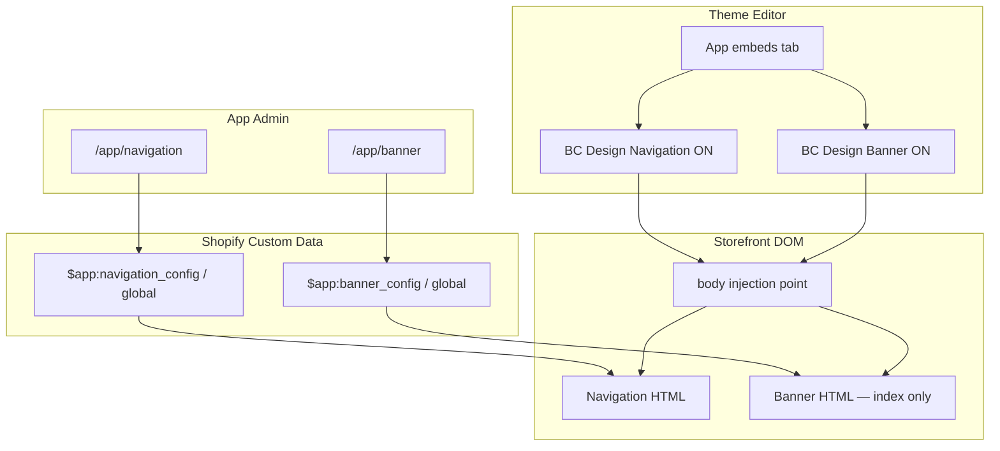

# App Embed Target Migration Design

## Context

The Navigation and Banner theme app extension blocks currently use `target: "section"`. Merchants must add them through **Theme editor → Section → Add block → Apps**, which is easy to miss and differs from the original demo (`floating_demo` used `target: "body"` and appeared under **App embeds**).

The storefront rendering, metaobject configuration layer, and app admin pages from the 2026-06-24 migration remain correct. This change only affects how merchants enable the modules in the theme editor and where Shopify injects the Liquid output in the page DOM.

## Goals

- Expose **Navigation Menu** and **Banner carousel** as two independent **app embeds** (`target: "body"`).
- Keep all content configuration in the embedded app admin (`/app/navigation`, `/app/banner`). Theme embeds provide only on/off toggles and setup instructions.
- Preserve existing storefront HTML structure, CSS class names, JS behavior, and metaobject data reads.
- Navigation app embed replaces the theme's native Header; merchants disable the theme Header section manually.
- Banner app embed renders **only on the homepage** (`template.name == 'index'`).

## Non-Goals

- Changing metaobject schemas, Admin GraphQL services, or app admin UI.
- Adding theme-editor settings for logo, colors, slides, or menu selection.
- Automatic hiding of the theme Header section (merchants do this manually).
- Per-page Banner visibility configuration in app admin (homepage-only is hardcoded in Liquid).

## Decisions

| Topic | Decision |
|-------|----------|
| Approach | Two separate app embed blocks (not merged, not mixed with section blocks) |
| Navigation target | `"target": "body"` — enabled globally when embed is on |
| Banner target | `"target": "body"` — Liquid outputs markup only when `template.name == 'index'` |
| Theme settings | Paragraph instructions only; no duplicated content settings |
| Header relationship | Navigation embed replaces theme Header; merchant disables theme Header |
| `banner_slide.liquid` | Remove — no longer needed without section sibling blocks |

## Architecture



Data flow is unchanged: app admin writes metaobjects; theme extension reads metaobjects in Liquid. Only the Shopify block `target` and merchant enablement path change.

## Theme Extension Changes

### `blocks/navigation_menu.liquid`

**Schema changes:**

```json
{
  "name": "BC Design Navigation",
  "target": "body",
  "stylesheet": "navigation-menu.css",
  "javascript": "navigation-animations.js",
  "settings": [
    {
      "type": "paragraph",
      "content": "Configure navigation in Apps → BC Design → Navigation. Disable your theme's Header section to avoid duplicate navigation."
    }
  ]
}
```

**Liquid changes:**

- Keep existing metaobject reads, markup, snippets, inline styles, and scripts.
- Remove redundant manual `<link>` / `<script>` tags if they duplicate schema `stylesheet` / `javascript` entries (prefer schema declarations for app embeds, matching the old `floating_demo` pattern).
- Keep `{{ block.shopify_attributes }}` on the root wrapper for theme editor highlighting.
- No template guard — navigation renders on all pages when the embed is enabled.

### `blocks/banner_carousel.liquid`

**Schema changes:**

```json
{
  "name": "BC Design Banner",
  "target": "body",
  "stylesheet": "banner-carousel.css",
  "javascript": "banner-carousel.js",
  "settings": [
    {
      "type": "paragraph",
      "content": "Configure the homepage banner in Apps → BC Design → Banner. This embed only renders on the homepage."
    }
  ]
}
```

**Liquid changes:**

- Wrap all banner output in a homepage guard:

```liquid

  ... existing banner rendering ...

```

- When not on the homepage, output nothing (no empty placeholder div).
- Keep full-bleed CSS (`100vw` breakout), cursor SVG variables, track slide loop, and `banner_carousel_slide` snippet calls unchanged inside the guard.

### `blocks/banner_slide.liquid`

Delete this file. It existed only as a compatibility stub for the old section sibling-block model.

### Locales

Update `extensions/bc-design-theme/locales/en.default.json` and `en.default.schema.json` with app embed block names and paragraph labels if needed for theme editor display.

## DOM Placement And Styling

Shopify app embeds inject at the end of `<body>`. The legacy navigation uses fixed/sticky positioning and high z-index values, so visual placement at the top of the viewport should remain correct even when the DOM node is appended late.

Verification during implementation:

- With theme Header disabled, navigation appears once at the top.
- No duplicate nav bars or clipped dropdowns.
- Homepage Banner appears below navigation when both embeds are enabled in the correct order.
- Banner full-bleed layout and carousel JS still initialize on index pages only.

**Embed order in App embeds:** Navigation should be listed/enabled above Banner so injected DOM order is navigation first, then banner.

## Merchant Setup Flow

1. Install or open the app on the dev store.
2. Run `shopify app dev` (or deploy) so the theme extension syncs.
3. **Online Store → Themes → Customize → App embeds**.
4. Enable **BC Design Navigation**.
5. Enable **BC Design Banner** (below Navigation in the list).
6. Open the theme **Header** section and disable or remove the native header.
7. Configure content in **Apps → BC Design → Navigation** and **Banner**.
8. Save the theme.

## What Stays Unchanged

- `shopify.app.toml` metaobject definitions and scopes.
- `app/lib/bc-design/*` services and config types.
- `app/routes/app.navigation.tsx` and `app/routes/app.banner.tsx`.
- Metaobject lookup paths:

```liquid


```

- All navigation snippets, banner snippets, and asset files (CSS, JS, SVG).

## Error And Empty States

| Condition | Behavior |
|-----------|----------|
| Navigation embed on, no metaobject config | Show existing empty-state message |
| Banner embed on, no config, on homepage | Show existing empty-state message |
| Banner embed on, not homepage | Render nothing |
| Navigation embed off | No navigation output |
| Theme Header still enabled | Both theme header and app navigation may appear — documented as merchant misconfiguration |

## Migration From Section Blocks

Stores that already added **Navigation Menu** or **Banner carousel** as section blocks should:

1. Remove those blocks from their sections in the theme editor.
2. Enable the new app embeds instead.

There is no automatic migration. Section blocks and app embeds are separate enablement paths.

## Testing

### Theme editor

- Both modules appear under **App embeds**, not only under section block pickers.
- Toggles enable/disable without errors.
- Paragraph instructions display correctly.

### Storefront

- **Homepage:** navigation + banner render from metaobjects; carousel JS runs; all slides render (no five-slide cap).
- **Product/collection/other templates:** navigation only; no banner markup in page source.
- **Theme Header disabled:** single navigation bar; dropdowns, mobile drawer, fixed nav behavior match legacy.
- **Banner:** image ratios, overlay, indicators, autoplay, pause on hover, video fallback unchanged.

### Automated

- `npm run typecheck` and `npm run lint` pass.
- `shopify app config validate` passes (no theme extension schema errors).

## Implementation Scope Estimate

Single focused task: theme extension block schema and Liquid guard changes, locale updates, delete `banner_slide.liquid`, update this spec's parent migration doc cross-reference if useful. No app code changes required.
