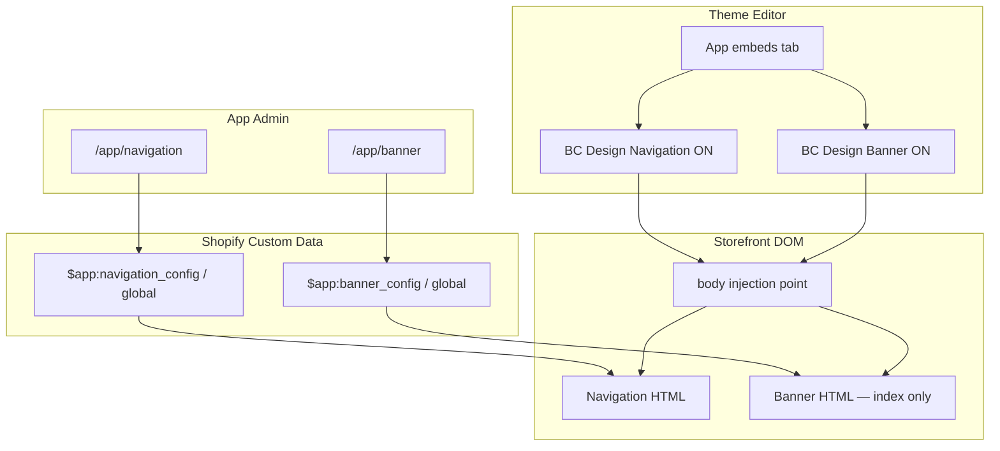

# App Embed Target Migration Design

## Context

The Navigation and Banner theme app extension blocks currently use `target: "section"`. Merchants must add them through **Theme editor → Section → Add block → Apps**, which is easy to miss and differs from the original demo (`floating_demo` used `target: "body"` and appeared under **App embeds**).

The storefront rendering, metaobject configuration layer, and app admin pages from the 2026-06-24 migration remain correct. This change only affects how merchants enable the modules in the theme editor and where Shopify injects the Liquid output in the page DOM.

## Goals

- Expose **Navigation Menu** and **Banner carousel** as two independent **app embeds** (`target: "body"`).
- Keep all content configuration in the embedded app admin (`/app/navigation`, `/app/banner`). Theme embeds provide only on/off toggles and setup instructions.
- Preserve existing storefront HTML structure, CSS class names, JS behavior, and metaobject data reads.
- Navigation app embed replaces the theme's native Header; merchants disable the theme Header section manually.
- Banner app embed renders **only on the homepage** (`template.name == 'index'`).

## Non-Goals

- Changing metaobject schemas, Admin GraphQL services, or app admin UI.
- Adding theme-editor settings for logo, colors, slides, or menu selection.
- Automatic hiding of the theme Header section (merchants do this manually).
- Per-page Banner visibility configuration in app admin (homepage-only is hardcoded in Liquid).

## Decisions

| Topic | Decision |
|-------|----------|
| Approach | Two separate app embed blocks (not merged, not mixed with section blocks) |
| Navigation target | `"target": "body"` — enabled globally when embed is on |
| Banner target | `"target": "body"` — Liquid outputs markup only when `template.name == 'index'` |
| Theme settings | Paragraph instructions only; no duplicated content settings |
| Header relationship | Navigation embed replaces theme Header; merchant disables theme Header |
| `banner_slide.liquid` | Remove — no longer needed without section sibling blocks |

## Architecture



Data flow is unchanged: app admin writes metaobjects; theme extension reads metaobjects in Liquid. Only the Shopify block `target` and merchant enablement path change.

## Theme Extension Changes

### DOM placement strategy (body embed invariant)

Shopify `target: "body"` app embeds inject near the end of `<body>`. That is an enablement-path change **and** a DOM placement change. The implementation must not rely on normal document flow or merchant app-embed list order for top-of-page layout.

**Rules:**

1. **Navigation** always renders with `phaetus-nav-root--fixed` in app embed mode, regardless of the `fixed_navigation` metaobject value. App embed navigation replaces the theme Header and must pin to the viewport top. The metaobject field remains in app admin for parity with legacy data but does not disable the fixed shell in embed mode.
2. **Banner (index only)** must appear as a homepage hero directly below the navigation bar, matching legacy section-block placement as closely as possible.
3. **Deterministic ordering** must not depend on App embeds list order. Use placement scripts (below), not merchant ordering alone.

**Placement scripts (new shared asset `bc-design-embed-placement.js`):**

- Loaded by both embed blocks (declared in each block schema `javascript` array is not supported — use manual `<script defer>` tag in each block, or one shared script included from both blocks; prefer one shared asset included from both blocks to avoid duplication).
- On `DOMContentLoaded`:
  - Move the navigation root (`#nav-root-*`) to `document.body.firstElementChild` if not already the first child.
  - On `template.name == 'index'` only: move the banner carousel root (`banner-carousel.bc-banner-carousel` or `#shopify-block-*` wrapper) to immediately follow the navigation root.
  - Set `--bc-design-nav-height` CSS variable on `document.documentElement` from the measured navigation height so banner/full-bleed layout can offset correctly if needed.
- Scripts are idempotent and no-op when elements are already in the correct position.

**Alternative rejected:** keeping Banner as a section block — conflicts with the decision to use two app embeds.

**Alternative rejected:** relying on `position: fixed` for banner — breaks hero document flow and complicates full-bleed breakout relative to page content.

### `blocks/navigation_menu.liquid`

**Schema changes:**

```json
{
  "name": "BC Design Navigation",
  "target": "body",
  "stylesheet": "navigation-menu.css",
  "settings": [
    {
      "type": "paragraph",
      "content": "Configure navigation in Apps → BC Design → Navigation. Disable your theme's Header section to avoid duplicate navigation."
    }
  ]
}
```

**Liquid changes:**

- Keep existing metaobject reads, markup, snippets, and inline styles.
- **Always** add `phaetus-nav-root--fixed` on the root element in embed mode (do not gate on `fixed_navigation`).
- Keep **manual** script tags in this order (schema supports only one `javascript` entry; GSAP is a hard dependency):

```liquid
<script src="{{ 'gsap.min.js' | asset_url }}" defer></script>
<script src="{{ 'navigation-animations.js' | asset_url }}" defer></script>
<script src="{{ 'bc-design-embed-placement.js' | asset_url }}" defer></script>
```

- Remove the manual `<link rel="stylesheet">` for `navigation-menu.css` when schema `stylesheet` is declared (avoid duplicate load).
- Keep `{{ block.shopify_attributes }}` on the root wrapper.
- No template guard — navigation renders on all pages when the embed is enabled.

### `blocks/banner_carousel.liquid`

**Schema changes:**

```json
{
  "name": "BC Design Banner",
  "target": "body",
  "stylesheet": "banner-carousel.css",
  "settings": [
    {
      "type": "paragraph",
      "content": "Configure the homepage banner in Apps → BC Design → Banner. This embed only renders on the homepage."
    }
  ]
}
```

**Liquid changes:**

- Wrap all banner output in a homepage guard:

```liquid

  ... existing banner rendering ...
  <script src="{{ 'banner-carousel.js' | asset_url }}" defer></script>
  <script src="{{ 'bc-design-embed-placement.js' | asset_url }}" defer></script>

```

- Remove manual `<link>` / `<script>` for assets already declared in schema (`banner-carousel.css` via schema; `banner-carousel.js` stays manual because placement script must also load).
- When not on the homepage, output nothing (no empty placeholder div).
- Keep full-bleed CSS, cursor SVG variables, track slide loop, and `banner_carousel_slide` snippet calls unchanged inside the guard.

### `assets/bc-design-embed-placement.js`

New file. Small, no dependencies. Responsibilities documented in **DOM placement strategy** above. Must be safe to load twice (both blocks may include it on homepage).

### `blocks/banner_slide.liquid`

**Delete** for this project. The app is unreleased on dev stores; no merchant themes depend on the section sibling-block stub. If a deployed store later references it, reintroduce a no-op stub in a follow-up migration.

### Locales

Update both locale files explicitly:

**`locales/en.default.json`**

```json
{
  "navigation_menu": {
    "name": "BC Design Navigation"
  },
  "banner_carousel": {
    "name": "BC Design Banner"
  }
}
```

Remove `banner_slide` key.

**`locales/en.default.schema.json`**

```json
{
  "blocks": {
    "navigation_menu": {
      "name": "BC Design Navigation"
    },
    "banner_carousel": {
      "name": "BC Design Banner"
    }
  }
}
```

Remove `banner_slide` block entry.

## DOM Placement And Styling

Shopify app embeds inject at the end of `<body>`. Visual top-of-page placement is handled by:

1. Forced `phaetus-nav-root--fixed` on navigation embed.
2. Shared `bc-design-embed-placement.js` moving navigation and banner nodes to the top of `<body>` in deterministic order on load.

Verification during implementation:

- With theme Header disabled, navigation appears once at the top on all templates.
- **Homepage:** banner hero appears directly below navigation, not at the bottom of the page.
- **Non-homepage:** no banner markup in HTML source.
- No duplicate nav bars or clipped dropdowns.
- Banner full-bleed layout and carousel JS initialize only on index pages.
- **Reversed App embeds order in theme editor** still produces navigation above banner (placement script invariant).

**Embed order in App embeds:** still recommend Navigation above Banner for clarity, but implementation must not require it.

## Merchant Setup Flow

1. Install or open the app on the dev store.
2. Run `shopify app dev` (or deploy) so the theme extension syncs.
3. **Online Store → Themes → Customize → App embeds**.
4. Enable **BC Design Navigation**.
5. Enable **BC Design Banner** (below Navigation in the list).
6. Open the theme **Header** section and disable or remove the native header.
7. Configure content in **Apps → BC Design → Navigation** and **Banner**.
8. Save the theme.

## What Stays Unchanged

- `shopify.app.toml` metaobject definitions and scopes.
- `app/lib/bc-design/*` services and config types.
- `app/routes/app.navigation.tsx` and `app/routes/app.banner.tsx`.
- Metaobject lookup paths:

```liquid


```

- All navigation snippets, banner snippets, and asset files (CSS, JS, SVG).

## Error And Empty States

| Condition | Behavior |
|-----------|----------|
| Navigation embed on, no metaobject config | Show existing empty-state message |
| Banner embed on, no config, on homepage | Show existing empty-state message |
| Banner embed on, not homepage | Render nothing |
| Navigation embed off | No navigation output |
| Theme Header still enabled | Both theme header and app navigation may appear — documented as merchant misconfiguration |

## Migration From Section Blocks

Stores that already added **Navigation Menu** or **Banner carousel** as section blocks should:

1. Remove those blocks from their sections in the theme editor.
2. Enable the new app embeds instead.

There is no automatic migration. Section blocks and app embeds are separate enablement paths.

## Testing

### Theme editor

- Both modules appear under **App embeds**, not only under section block pickers.
- Toggles enable/disable without errors.
- Paragraph instructions display correctly.

### Storefront

- **Homepage:** navigation + banner render from metaobjects; carousel JS runs; all slides render (no five-slide cap).
- **Product/collection/other templates:** navigation only; no banner markup in page source.
- **Theme Header disabled:** single navigation bar; dropdowns, mobile drawer, fixed nav behavior match legacy.
- **Banner:** image ratios, overlay, indicators, autoplay, pause on hover, video fallback unchanged.

### Automated

- `npm test`, `npm run typecheck`, and `npm run lint` pass.
- `npm run config:use -- localhost` then `npm run shopify -- app config validate --path . --json`
- Dev smoke test: `npm run dev:localhost` — confirm both modules appear under **App embeds** and homepage layout is correct.

## Design Review Resolutions

Reviewed against `docs/superpowers/specs/review.md` on 2026-06-24.

| Finding | Resolution |
|---------|------------|
| Banner at body end, not below nav | `bc-design-embed-placement.js` prepends nav then banner on index |
| Non-fixed nav at body end | App embed always uses `phaetus-nav-root--fixed` |
| GSAP load order / single schema `javascript` | Keep manual `gsap.min.js` + `navigation-animations.js`; schema `stylesheet` only for nav |
| Delete `banner_slide.liquid` compatibility | Delete — unreleased dev store only |
| Embed order not guaranteed | Placement script makes order deterministic; test reversed embed order |
| Vague locale guidance | Exact keys listed above; remove `banner_slide` |
| Validation commands | Added localhost config validate + dev smoke test |

## Implementation Scope Estimate

Single focused task: theme extension block schema and Liquid changes, new `bc-design-embed-placement.js`, locale updates, delete `banner_slide.liquid`. No app code changes required.
