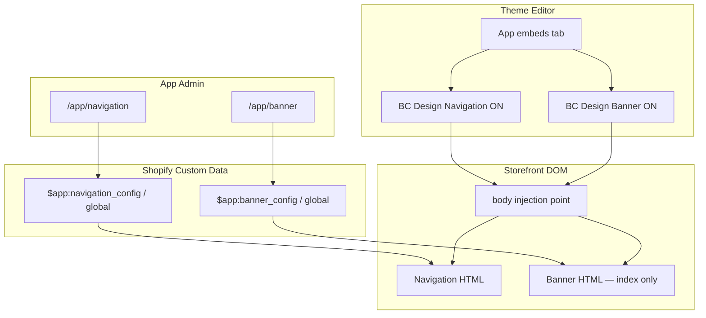

# App Embed Target Migration Design

## Context

The Navigation and Banner theme app extension blocks currently use `target: "section"`. Merchants must add them through **Theme editor → Section → Add block → Apps**, which is easy to miss and differs from the original demo (`floating_demo` used `target: "body"` and appeared under **App embeds**).

The storefront rendering, metaobject configuration layer, and app admin pages from the 2026-06-24 migration remain correct. This change only affects how merchants enable the modules in the theme editor and where Shopify injects the Liquid output in the page DOM.

## Goals

- Expose **Navigation Menu** and **Banner carousel** as two independent **app embeds** (`target: "body"`).
- Keep all content configuration in the embedded app admin (`/app/navigation`, `/app/banner`). Theme embeds provide only on/off toggles and setup instructions.
- Preserve existing storefront HTML structure, CSS class names, JS behavior, and metaobject data reads.
- Navigation app embed replaces the theme's native Header; merchants disable the theme Header section manually.
- Banner app embed renders **only on the homepage** (`template.name == 'index'`).

## Non-Goals

- Changing metaobject schemas, Admin GraphQL services, or app admin UI.
- Adding theme-editor settings for logo, colors, slides, or menu selection.
- Automatic hiding of the theme Header section (merchants do this manually).
- Per-page Banner visibility configuration in app admin (homepage-only is hardcoded in Liquid).

## Decisions

| Topic | Decision |
|-------|----------|
| Approach | Two separate app embed blocks (not merged, not mixed with section blocks) |
| Navigation target | `"target": "body"` — enabled globally when embed is on |
| Banner target | `"target": "body"` — Liquid outputs markup only when `template.name == 'index'` |
| Theme settings | Paragraph instructions only; no duplicated content settings |
| Header relationship | Navigation embed replaces theme Header; merchant disables theme Header |
| `banner_slide.liquid` | Remove — no longer needed without section sibling blocks |

## Architecture



Data flow is unchanged: app admin writes metaobjects; theme extension reads metaobjects in Liquid. Only the Shopify block `target` and merchant enablement path change.

## Theme Extension Changes

### DOM placement strategy (body embed invariant)

Shopify `target: "body"` app embeds inject near the end of `<body>`. That is an enablement-path change **and** a DOM placement change. The implementation must not rely on normal document flow or merchant app-embed list order for top-of-page layout.

**Rules:**

1. **Navigation** always renders with `phaetus-nav-root--fixed` in app embed mode, regardless of the `fixed_navigation` metaobject value. App embed navigation replaces the theme Header and must pin to the viewport top. The metaobject field remains in app admin for parity with legacy data but does not disable the fixed shell in embed mode.
2. **Banner (index only)** must appear as a homepage hero directly below the navigation bar, matching legacy section-block placement as closely as possible.
3. **Deterministic ordering** must not depend on App embeds list order. Use placement scripts (below), not merchant ordering alone.

**Placement scripts (new shared asset `bc-design-embed-placement.js`):**

- Loaded by both embed blocks via manual `<script defer>` (one shared asset; both blocks may include it on the homepage).
- **Initialization contract** (required — both blocks may load the same script):
  - Expose `window.BCDesignEmbedPlacement.run()` as the single entry point.
  - Guard with `window.__BC_DESIGN_EMBED_PLACEMENT_LOADED__` so only one listener registers.
  - `run()` is idempotent; call immediately when `document.readyState !== 'loading'`, otherwise on `DOMContentLoaded`.
- **Stable embed markers** (required in Liquid — configured and empty states):
  - Navigation block root wrapper: `data-bc-design-embed="navigation"` on an outer element present in both configured and empty output.
  - Banner block root wrapper (index only): `data-bc-design-embed="banner"` on an outer element present in both configured and empty output.
  - Placement script targets `[data-bc-design-embed="navigation"]` and `[data-bc-design-embed="banner"]`, never content-specific selectors such as `#nav-root-*` or `banner-carousel.bc-banner-carousel` alone.
- **Move Shopify block wrappers, not inner roots only:**
  - For each embed marker, resolve `embedEl.closest('[id^="shopify-block-"]')` and move that wrapper node when present.
  - Moving only the inner root detaches `#shopify-block-{{ bid }}` scoped styles (full-bleed width, z-index, dropdown layering) and can break theme editor block highlighting.
- **Insert position** (do not blindly use `document.body.firstElementChild`):
  - Prefer inserting after accessibility affordances at the top of `<body>`: skip links (`a[href="#MainContent"]`, `.skip-to-content`, `[class*="skip"]`) and Shopify/theme editor injected nodes that must remain first.
  - If no skip link is found, insert before the theme's first main content landmark (`main`, `#MainContent`, `.shopify-section` in header group) or prepend to `<body>` as fallback.
- **Ordering:**
  - Navigation wrapper first, banner wrapper immediately after navigation wrapper on index pages.
  - Order must not depend on App embeds list order in the theme editor.
- **Fixed-navigation spacing (required on index — single owner, no double gap):**
  - Legacy CSS already reserves flow space when navigation is fixed: `.phaetus-nav-root--fixed { min-height: var(--nav-height); }` while `.navbar` is `position: fixed`.
  - When the navigation Shopify block wrapper sits immediately before the banner wrapper, that `min-height` already pushes the banner below the nav bar in document flow.
  - **Do not** also apply `margin-top` on the banner wrapper when configured navigation is present — that creates a double nav-height gap.
  - **Spacing owner:** keep nav root `min-height` reservation; banner wrapper gets **no extra top margin** when a configured `[data-bc-design-embed="navigation"]` block precedes it.
  - **Empty navigation state:** if navigation embed is enabled but unconfigured (empty-state only), measure the empty wrapper height instead and apply banner offset only when the nav block does not reserve height via `phaetus-nav-root--fixed`.
  - Set `--bc-design-nav-height` from the measured **fixed bar** (`.navbar` inside configured nav, or empty-state box height), not blindly the Shopify wrapper outer box, for diagnostics and any future offset needs.
  - Re-run measurement on `resize` and across breakpoints.
  - **Test:** homepage banner top sits exactly below the nav bar within a small pixel tolerance (e.g. ≤ 4px) on desktop and mobile — no double gap.
- **CLS / FOUC mitigation (required):**
  - Add a temporary hide class (e.g. `bc-design-embed--pending`) on `[data-bc-design-embed]` wrappers via inline style or small critical CSS in each block until `BCDesignEmbedPlacement.run()` completes.
  - Run placement as early as safely possible (`DOMContentLoaded` or immediately if document already interactive).
  - Always remove the hide class after `run()` finishes, even when one embed is missing or empty.
  - **Test:** throttled CPU / slow network in theme preview — banner must not visibly jump from page bottom to top.
- `run()` no-ops when elements are already in the correct position.

**Alternative rejected:** keeping Banner as a section block — conflicts with the decision to use two app embeds.

**Alternative rejected:** relying on `position: fixed` for banner — breaks hero document flow and complicates full-bleed breakout relative to page content.

### `blocks/navigation_menu.liquid`

**Schema changes:**

```json
{
  "name": "BC Design Navigation",
  "target": "body",
  "stylesheet": "navigation-menu.css",
  "settings": [
    {
      "type": "paragraph",
      "content": "Configure navigation in Apps → BC Design → Navigation. Disable your theme's Header section to avoid duplicate navigation."
    }
  ]
}
```

**Liquid changes:**

- Wrap all block output (configured and empty states) in a stable outer element:

```liquid
<div data-bc-design-embed="navigation" class="bc-design-embed--pending">
  
  <div class="phaetus-nav-empty" {{ block.shopify_attributes }}>...</div>
  
  ... existing configured markup ...
  
</div>
```

- Add critical inline style or asset rule: `.bc-design-embed--pending { visibility: hidden; }` removed by placement script after `run()`.

- Keep existing metaobject reads, markup, snippets, and inline styles inside the wrapper.
- **Always** add `phaetus-nav-root--fixed` on the configured root element in embed mode (do not gate on `fixed_navigation`).
- Keep **manual** script tags in this order (schema supports only one `javascript` entry; GSAP is a hard dependency):

```liquid
<script src="{{ 'gsap.min.js' | asset_url }}" defer></script>
<script src="{{ 'navigation-animations.js' | asset_url }}" defer></script>
<script src="{{ 'bc-design-embed-placement.js' | asset_url }}" defer></script>
```

- Remove the manual `<link rel="stylesheet">` for `navigation-menu.css` when schema `stylesheet` is declared (avoid duplicate load).
- Keep `{{ block.shopify_attributes }}` on the visible root (configured `phaetus-nav-root` or empty-state div).
- No template guard — navigation renders on all pages when the embed is enabled.

### `blocks/banner_carousel.liquid`

**Schema changes:**

```json
{
  "name": "BC Design Banner",
  "target": "body",
  "stylesheet": "banner-carousel.css",
  "settings": [
    {
      "type": "paragraph",
      "content": "Configure the homepage banner in Apps → BC Design → Banner. This embed only renders on the homepage."
    }
  ]
}
```

**Liquid changes:**

- Wrap all index output (configured and empty states) in a stable outer element:

```liquid

<div data-bc-design-embed="banner" class="bc-design-embed--pending">
  
  <div class="bc-banner-carousel-empty" {{ block.shopify_attributes }}>...</div>
  
  ... existing banner rendering ...
  
  <script src="{{ 'banner-carousel.js' | asset_url }}" defer></script>
  <script src="{{ 'bc-design-embed-placement.js' | asset_url }}" defer></script>
</div>

```

- Remove manual `<link>` for `banner-carousel.css` when schema `stylesheet` is declared.
- When not on the homepage, output nothing (no empty placeholder div).
- Keep full-bleed CSS on `#shopify-block-{{ bid }}`, cursor SVG variables, track slide loop, and `banner_carousel_slide` snippet calls unchanged inside the guard.

### `assets/banner-carousel.js`

**Required change for app embed DOM move:**

Placement moves the banner Shopify block wrapper after `banner-carousel.js` has already upgraded `<banner-carousel>`. Moving the node disconnects and reconnects the custom element, which can run `connectedCallback()` twice and duplicate indicators, event listeners, and autoplay.

**Chosen approach:** make `BcBannerCarousel` lifecycle idempotent (do not rely on script reorder alone).

- Add a private init guard (e.g. `this.__bcBannerInitToken`) so `connectedCallback()` only schedules initialization once per element instance until `disconnectedCallback()` cleans up.
- Implement `disconnectedCallback()` to:
  - clear pending `setTimeout` init timers;
  - stop autoplay / progress animation;
  - remove listeners added in `setupNavigation`, `setupCursorNavigation`, `bindEvents`, and indicator clicks;
  - reset `this.indicators`, `this.slides`, and related instance state.
- After cleanup, a subsequent `connectedCallback()` from placement move may re-init safely exactly once.
- Do not change carousel public behavior, class names, or slide collection logic beyond this lifecycle hardening.

**Verification after placement move:**

- Next/previous advances exactly one slide per click.
- Autoplay runs only one active progress cycle.
- Indicators are not duplicated.
- Touch and cursor-click navigation do not fire twice.

### `assets/bc-design-embed-placement.js`

New file. Small, no dependencies. Implements the contract in **DOM placement strategy** above.

**Required behavior summary:**

```js
// Pseudocode — implementation guide
window.BCDesignEmbedPlacement = window.BCDesignEmbedPlacement || {
  run() {
    const navEmbed = document.querySelector('[data-bc-design-embed="navigation"]');
    const bannerEmbed = document.querySelector('[data-bc-design-embed="banner"]');
    const navBlock = navEmbed?.closest('[id^="shopify-block-"]');
    const bannerBlock = bannerEmbed?.closest('[id^="shopify-block-"]');
    const insertAfter = findAccessibilityAnchor(); // skip links, etc.
    moveBlock(navBlock, insertAfter);
    moveBlock(bannerBlock, navBlock);
    applyBannerSpacing(navBlock, bannerBlock); // no margin-top when nav min-height reserves flow
    revealEmbeds(); // remove .bc-design-embed--pending from all [data-bc-design-embed]
  },
};
if (!window.__BC_DESIGN_EMBED_PLACEMENT_LOADED__) {
  window.__BC_DESIGN_EMBED_PLACEMENT_LOADED__ = true;
  const start = () => window.BCDesignEmbedPlacement.run();
  document.readyState === 'loading'
    ? document.addEventListener('DOMContentLoaded', start, { once: true })
    : start();
}
```

- Safe when loaded from both navigation and banner blocks on the same page.
- Listens to `resize` (debounced) to refresh `--bc-design-nav-height` and banner offset.

### `blocks/banner_slide.liquid`

**Delete** for this project. The app is unreleased on dev stores; no merchant themes depend on the section sibling-block stub. If a deployed store later references it, reintroduce a no-op stub in a follow-up migration.

### Locales

Update both locale files explicitly:

**`locales/en.default.json`**

```json
{
  "navigation_menu": {
    "name": "BC Design Navigation"
  },
  "banner_carousel": {
    "name": "BC Design Banner"
  }
}
```

Remove `banner_slide` key.

**`locales/en.default.schema.json`**

```json
{
  "blocks": {
    "navigation_menu": {
      "name": "BC Design Navigation"
    },
    "banner_carousel": {
      "name": "BC Design Banner"
    }
  }
}
```

Remove `banner_slide` block entry.

## DOM Placement And Styling

Shopify app embeds inject at the end of `<body>`. Visual top-of-page placement is handled by:

1. Forced `phaetus-nav-root--fixed` on navigation embed (nav root `min-height` owns flow spacing).
2. Shared `bc-design-embed-placement.js` moving **Shopify block wrappers** to the correct top-of-body position.
3. Banner sits directly below navigation wrapper with **no duplicate** `margin-top` when configured fixed nav is present.
4. Temporary `bc-design-embed--pending` hide until placement completes (CLS mitigation).

Verification during implementation:

- With theme Header disabled, navigation appears once at the top on all templates.
- **Homepage:** banner hero appears directly below navigation with **no double nav-height gap** (≤ 4px tolerance).
- **Homepage:** no visible banner jump from page bottom on slow network / throttled CPU.
- **Homepage empty states:** navigation/banner setup messages appear near the top (placement script moves empty-state wrappers too).
- **Non-homepage:** no banner markup in HTML source.
- No duplicate nav bars or clipped dropdowns.
- Banner full-bleed layout and carousel JS initialize only on index pages.
- **Reversed App embeds order** in theme editor still produces navigation above banner.
- **Dawn-like theme:** skip link remains usable; app embeds insert after skip link, not before it.
- **Resize:** banner offset updates when navigation height changes across breakpoints.

**Embed order in App embeds:** still recommend Navigation above Banner for clarity, but implementation must not require it.

## Merchant Setup Flow

1. Install or open the app on the dev store.
2. Run `shopify app dev` (or deploy) so the theme extension syncs.
3. **Online Store → Themes → Customize → App embeds**.
4. Enable **BC Design Navigation**.
5. Enable **BC Design Banner** (below Navigation in the list).
6. Open the theme **Header** section and disable or remove the native header.
7. Configure content in **Apps → BC Design → Navigation** and **Banner**.
8. Save the theme.

## What Stays Unchanged

- `shopify.app.toml` metaobject definitions and scopes.
- `app/lib/bc-design/*` services and config types.
- `app/routes/app.navigation.tsx` and `app/routes/app.banner.tsx`.
- Metaobject lookup paths:

```liquid


```

- All navigation snippets, banner snippets, and asset files (CSS, JS, SVG).

## Error And Empty States

| Condition | Behavior |
|-----------|----------|
| Navigation embed on, no metaobject config | Show empty-state message at top (wrapper moved by placement script) |
| Banner embed on, no config, on homepage | Show empty-state message at top below nav offset area |
| Banner embed on, not homepage | Render nothing |
| Navigation embed off | No navigation output |
| Theme Header still enabled | Both theme header and app navigation may appear — documented as merchant misconfiguration |

## Migration From Section Blocks

Stores that already added **Navigation Menu** or **Banner carousel** as section blocks should:

1. Remove those blocks from their sections in the theme editor.
2. Enable the new app embeds instead.

There is no automatic migration. Section blocks and app embeds are separate enablement paths.

## Testing

### Theme editor

- Both modules appear under **App embeds**, not only under section block pickers.
- Toggles enable/disable without errors.
- Paragraph instructions display correctly.

### Storefront

- **Homepage:** navigation + banner render from metaobjects; carousel JS runs; all slides render (no five-slide cap).
- **Homepage unconfigured:** empty-state messages appear near top, not at page bottom.
- **Product/collection/other templates:** navigation only; no banner markup in page source.
- **Theme Header disabled:** single navigation bar; dropdowns, mobile drawer, fixed nav behavior match legacy.
- **Banner:** first visible pixel directly below fixed nav (no double gap); image ratios, overlay, indicators, autoplay, pause on hover, video fallback unchanged.
- **Banner carousel lifecycle:** after placement DOM move, next/prev, autoplay, indicators, touch, and cursor nav each work once (no duplicate bindings).
- **CLS:** no visible embed jump on throttled theme preview.
- **Skip link:** remains first focusable affordance on Dawn-like themes.

### Automated

- `npm test`, `npm run typecheck`, and `npm run lint` pass.
- `npm run config:use -- localhost` then `npm run shopify -- app config validate --path . --json`
- Dev smoke test: `npm run dev:localhost` — confirm both modules appear under **App embeds** and homepage layout is correct.

## Design Review Resolutions

Reviewed against local `docs/superpowers/specs/review.md` (not version-controlled).

### First pass

| Finding | Resolution |
|---------|------------|
| Banner at body end, not below nav | `bc-design-embed-placement.js` moves block wrappers to top |
| Non-fixed nav at body end | App embed always uses `phaetus-nav-root--fixed` |
| GSAP load order / single schema `javascript` | Keep manual `gsap.min.js` + `navigation-animations.js`; schema `stylesheet` only for nav |
| Delete `banner_slide.liquid` compatibility | Delete — unreleased dev store only |
| Embed order not guaranteed | Placement script makes order deterministic; test reversed embed order |
| Vague locale guidance | Exact keys listed above; remove `banner_slide` |
| Validation commands | Added localhost config validate + dev smoke test |

### Second pass

| Finding | Resolution |
|---------|------------|
| Move inner root only breaks `#shopify-block-*` styles | Move `closest('[id^="shopify-block-"]')` wrapper |
| Empty states not moved | `data-bc-design-embed` wrappers on configured and empty output |
| Fixed nav covers banner | Nav `min-height` owns spacing; no duplicate banner `margin-top` |
| `firstElementChild` breaks skip links | Insert after skip-link/accessibility anchors |
| Double script load races | `__BC_DESIGN_EMBED_PLACEMENT_LOADED__` + idempotent `run()` |

### Third pass

| Finding | Resolution |
|---------|------------|
| Banner offset double-counts nav `min-height` | Keep nav flow reservation; no banner `margin-top` when configured nav precedes banner |
| `DOMContentLoaded` placement causes CLS | `bc-design-embed--pending` hide until `run()` completes; always reveal after |

### Fourth pass

| Finding | Resolution |
|---------|------------|
| Moving `<banner-carousel>` re-runs `connectedCallback` | Idempotent `connectedCallback` + cleanup `disconnectedCallback` in `banner-carousel.js` |

## Implementation Scope Estimate

Single focused task: theme extension block schema and Liquid changes (including `data-bc-design-embed` wrappers), new `bc-design-embed-placement.js`, `banner-carousel.js` lifecycle hardening, locale updates, delete `banner_slide.liquid`. No app admin code changes required.
