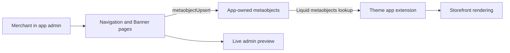

# Navigation And Banner Migration Design

## Context

The current app was created with `shopify app init` and already has a theme app extension demo at `extensions/bc-design-theme`. The previous app at `/Users/xixi/projects/bc/shopify` contains the target storefront implementation in `extensions/bc-design-mega-menu`, including:

- Navigation: `blocks/navigation_menu.liquid`, navigation snippets, `navigation-menu.css`, `navigation-animations.js`, and `gsap.min.js`.
- Banner: `blocks/banner_carousel.liquid`, `blocks/banner_slide.liquid`, `snippets/banner_carousel_slide.liquid`, `banner-carousel.css`, `banner-carousel.js`, and cursor SVG assets.

The migration must preserve storefront rendering as closely as possible: HTML structure, CSS class names, image ratios, alignment, layout, animation, and interaction should remain unchanged unless a data-source change requires a minimal adjustment.

## Goals

- Move Navigation and Banner configuration from theme editor block settings into the embedded app admin.
- Add two independent app pages:
  - `/app/navigation`
  - `/app/banner`
- Provide live admin previews for both features using the current form state.
- Store configuration in Shopify custom data so Liquid can render storefront output without an extra runtime fetch.
- Remove the old five-layout limit for navigation second-level menu configuration.
- Remove the old five-slide limit for Banner slides.
- Keep Shopify Files as the primary media source.
- Preserve the old Banner external `video_url` fallback as an optional compatibility field.

## Architecture

Use app-owned Shopify metaobjects as the shared configuration layer between the embedded app and the storefront theme extension.



The app writes configuration through Admin GraphQL. The theme extension reads the same configuration through Liquid `metaobjects`, keeping storefront rendering server-side and avoiding an app-proxy or client-side fetch dependency.

The data model uses parent configuration metaobjects plus child metaobjects for repeatable items. This keeps Shopify Files as real `file_reference` fields instead of storing media inside JSON.

Global configuration uses fixed handles:

- Navigation: type `$app:navigation_config`, handle `global`.
- Banner: type `$app:banner_config`, handle `global`.

The theme extension should verify the exact app-owned metaobject Liquid type string in the dev store before implementation is considered complete. The expected Liquid access pattern is:

```liquid


```

If Shopify resolves app-owned types differently in theme Liquid for this app, the implementation must update the lookup path and document the verified form.

## App Configuration And Scopes

`shopify.app.toml` should define the app-owned metaobject schema. The draft below is the implementation baseline; field names may be adjusted only if Shopify CLI validation requires it.

```toml
[metaobjects.app.navigation_config]
name = "Navigation configuration"
display_name_field = "title"

  [metaobjects.app.navigation_config.access]
  admin = "merchant_read_write"

[metaobjects.app.navigation_config.fields.title]
name = "Title"
type = "single_line_text_field"
required = true

[metaobjects.app.navigation_config.fields.fixed_navigation]
name = "Fixed navigation"
type = "boolean"

[metaobjects.app.navigation_config.fields.logo_type]
name = "Logo type"
type = "single_line_text_field"

[metaobjects.app.navigation_config.fields.logo_text]
name = "Logo text"
type = "single_line_text_field"

[metaobjects.app.navigation_config.fields.logo_file]
name = "Logo file"
type = "file_reference"

[metaobjects.app.navigation_config.fields.nav_background_color]
name = "Navigation background color"
type = "color"

[metaobjects.app.navigation_config.fields.primary_nav_text_color]
name = "Level 1 navigation text color"
type = "color"

[metaobjects.app.navigation_config.fields.secondary_nav_text_color]
name = "Level 2 navigation text color"
type = "color"

[metaobjects.app.navigation_config.fields.icon_color]
name = "Icon color"
type = "color"

[metaobjects.app.navigation_config.fields.menu_handle]
name = "Menu handle"
type = "single_line_text_field"

[metaobjects.app.navigation_config.fields.second_level_configs]
name = "Second-level configurations"
type = "list.metaobject_reference<$app:navigation_second_level>"

[metaobjects.app.navigation_second_level]
name = "Navigation second-level configuration"
display_name_field = "title"

  [metaobjects.app.navigation_second_level.access]
  admin = "merchant_read_write"

[metaobjects.app.navigation_second_level.fields.title]
name = "Title"
type = "single_line_text_field"
required = true

[metaobjects.app.navigation_second_level.fields.level_1_index]
name = "Level 1 index"
type = "number_integer"
required = true

[metaobjects.app.navigation_second_level.fields.level_2_index]
name = "Level 2 index"
type = "number_integer"
required = true

[metaobjects.app.navigation_second_level.fields.level_1_title]
name = "Level 1 title snapshot"
type = "single_line_text_field"

[metaobjects.app.navigation_second_level.fields.level_2_title]
name = "Level 2 title snapshot"
type = "single_line_text_field"

[metaobjects.app.navigation_second_level.fields.layout_type]
name = "Layout type"
type = "single_line_text_field"
required = true

[metaobjects.app.navigation_second_level.fields.big_image_1]
name = "Big image 1"
type = "file_reference"

[metaobjects.app.navigation_second_level.fields.big_image_2]
name = "Big image 2"
type = "file_reference"

[metaobjects.app.navigation_second_level.fields.big_image_3]
name = "Big image 3"
type = "file_reference"

[metaobjects.app.navigation_second_level.fields.ad_image]
name = "Product-list ad image"
type = "file_reference"

[metaobjects.app.navigation_second_level.fields.ad_url]
name = "Product-list ad link"
type = "url"

[metaobjects.app.banner_config]
name = "Banner configuration"
display_name_field = "title"

  [metaobjects.app.banner_config.access]
  admin = "merchant_read_write"

[metaobjects.app.banner_config.fields.title]
name = "Title"
type = "single_line_text_field"
required = true

[metaobjects.app.banner_config.fields.autoplay]
name = "Autoplay"
type = "boolean"

[metaobjects.app.banner_config.fields.autoplay_speed]
name = "Autoplay speed"
type = "number_integer"

[metaobjects.app.banner_config.fields.pause_on_hover]
name = "Pause on hover"
type = "boolean"

[metaobjects.app.banner_config.fields.show_indicators]
name = "Show indicators"
type = "boolean"

[metaobjects.app.banner_config.fields.mobile_height]
name = "Mobile height"
type = "number_integer"

[metaobjects.app.banner_config.fields.overlay_opacity]
name = "Overlay opacity"
type = "number_integer"

[metaobjects.app.banner_config.fields.slides]
name = "Slides"
type = "list.metaobject_reference<$app:banner_slide>"

[metaobjects.app.banner_slide]
name = "Banner slide"
display_name_field = "title"

  [metaobjects.app.banner_slide.access]
  admin = "merchant_read_write"

[metaobjects.app.banner_slide.fields.title]
name = "Title"
type = "single_line_text_field"
required = true

[metaobjects.app.banner_slide.fields.desktop_image]
name = "Desktop image"
type = "file_reference"

[metaobjects.app.banner_slide.fields.mobile_image]
name = "Mobile image"
type = "file_reference"

[metaobjects.app.banner_slide.fields.video]
name = "Shopify-hosted video"
type = "file_reference"

[metaobjects.app.banner_slide.fields.video_url]
name = "External video URL"
type = "url"

[metaobjects.app.banner_slide.fields.heading]
name = "Heading"
type = "single_line_text_field"

[metaobjects.app.banner_slide.fields.subheading]
name = "Subheading"
type = "single_line_text_field"

[metaobjects.app.banner_slide.fields.primary_button_label]
name = "Primary button label"
type = "single_line_text_field"

[metaobjects.app.banner_slide.fields.primary_button_link]
name = "Primary button link"
type = "url"

[metaobjects.app.banner_slide.fields.secondary_button_label]
name = "Secondary button label"
type = "single_line_text_field"

[metaobjects.app.banner_slide.fields.secondary_button_link]
name = "Secondary button link"
type = "url"
```

Required app scopes:

- `write_metaobject_definitions`: deploy and update app-owned metaobject definitions.
- `write_metaobjects`: save navigation and banner configurations.
- `read_online_store_navigation`: read Shopify menus for dynamic second-level configuration cards.
- `write_files`: upload and create Shopify Files from the embedded app.

`write_products` is only needed if the app keeps runtime product metafield-definition setup for `custom.nav_tag` and `custom.tips_tag`; otherwise it should be removed.

## Navigation Configuration

The Navigation page manages one active global navigation configuration.

Configuration fields:

- Fixed navigation toggle.
- Logo type, logo text, and logo file.
- Navigation background color.
- Level 1 navigation text color.
- Level 2 navigation text color.
- Header icon color.
- Shopify menu selection.
- Product badge metafield setup for `custom.nav_tag` and `custom.tips_tag`.

After a merchant selects a Shopify menu, the app reads that menu structure with Admin GraphQL and dynamically renders configuration cards for every second-level menu item. Each second-level item can be configured independently.

The parent navigation metaobject stores the global fields and a list of second-level configuration metaobject references.

Each second-level menu configuration stores:

- Level 1 index.
- Level 2 index.
- Parent level 1 title snapshot.
- Level 2 title snapshot.
- Layout type: `product_list` or `big_image`.
- Big image layout files: image 1, image 2, image 3.
- Product-list ad image.
- Product-list ad link.

The previous `layout_config_1` through `layout_config_5` model is not used. The saved data is an extensible list generated from the selected menu's real second-level items, so every second-level menu can be configured.

Liquid matching uses `forloop.index` for level 1 and level 2 because the storefront `linklists` object reliably exposes menu structure during rendering. The title snapshots are used in the app admin for readability and stale-configuration cleanup if the menu changes.

New or newly discovered second-level items default to `product_list`, matching the old storefront behavior when no layout override was found. The admin should save a child metaobject for every current second-level item when the navigation configuration is saved.

If the merchant reorders menu items, index-based matching can point an existing configuration at a different second-level menu. The admin should warn about this risk when the selected menu structure changes and should clean orphaned child configurations on save.

The parent navigation config stores `menu_handle` as a string because storefront Liquid still renders the actual menu with `linklists[menu_handle]`. Admin GraphQL may use menu IDs while editing, but the saved Liquid-facing value must be the menu handle.

## Banner Configuration

The Banner page manages one active global banner configuration.

Configuration fields:

- Autoplay toggle.
- Autoplay speed.
- Pause on hover toggle.
- Progress indicator toggle.
- Mobile height.
- Overlay opacity.
- Unlimited slide list with add, delete, and reorder controls.

The parent banner metaobject stores carousel behavior fields and a list of slide metaobject references.

Each slide metaobject stores:

- Desktop image file.
- Mobile image file.
- Shopify-hosted video file.
- Optional external video URL.
- Heading.
- Subheading.
- Primary button label and link.
- Secondary button label and link.

The old storefront carousel markup and styling remain the baseline. The implementation removes the old JavaScript `slice(0, 5)` slide cap and updates the data source so all configured slide metaobjects can render.

The old Banner implementation used a sibling-block pattern:

- `banner_carousel.liquid` rendered only the carousel container.
- `banner_slide.liquid` rendered `.bc-banner-slide` as sibling theme blocks in the same section.
- `banner-carousel.js` collected sibling slides with `collectSlides()` and moved up to five slides into the track.

The migrated implementation should render slides directly inside `banner_carousel.liquid` by looping `banner_config.slides.value` and rendering `snippets/banner_carousel_slide.liquid` inside `.bc-banner-carousel__track`. `banner-carousel.js` should stop moving sibling blocks, query only track-local `.bc-banner-slide` nodes, and remove the five-slide cap.

`banner_slide.liquid` is no longer needed as a merchant-editable child block. It can be removed from the active extension or kept only as an inert compatibility stub if Shopify requires deployed block cleanup during migration.

## Admin Pages

`/app/navigation`:

- Loads the current navigation metaobject.
- Lets merchants select a menu and configure global navigation styling.
- Dynamically lists all second-level menu items from the selected menu.
- Saves the full configuration with `metaobjectUpsert`.
- Shows a live preview using the current form state.
- Creates or refreshes product badge metafield definitions when the merchant clicks the setup action.

`/app/banner`:

- Loads the current banner metaobject.
- Lets merchants configure carousel behavior and an unlimited slide list.
- Saves the full configuration with `metaobjectUpsert`.
- Shows a live preview using the current form state.

The app navigation should replace template links with Home, Navigation, and Banner.

The admin menu selector should use Admin GraphQL `menus` / `menu` queries with `read_online_store_navigation`. Shopify Online Store menus support up to three levels, matching the old implementation's level 1, level 2, and optional level 3 resource behavior.

Media upload flow for all app-managed file fields:

1. Call `stagedUploadsCreate`.
2. Upload the file to the staged target.
3. Call `fileCreate`.
4. Save the returned file GID into the relevant metaobject field with `metaobjectUpsert`.

Save flow:

1. Upsert child metaobjects first: navigation second-level configs or banner slides.
2. Collect child GIDs in the display order.
3. Upsert the parent `global` config with the ordered `list.metaobject_reference` field.
4. If a child was deleted or became orphaned after menu changes, delete it with `metaobjectDelete` or `metaobjectBulkDelete`.
5. If any mutation returns userErrors, show them in the app UI and avoid updating the parent reference list to a partially failed state.

## Storefront Rendering

The theme app extension should migrate the old feature files into the current app extension.

Navigation rendering:

- Keep the old navigation HTML structure, snippets, CSS, animation files, and class names.
- Replace `block.settings.*` configuration reads with metaobject configuration reads.
- Keep menu traversal and product rendering behavior from the previous app.
- Match dynamic second-level menu configuration by 1-based `level_1_index` and `level_2_index`.
- Continue reading product badge images from `product.metafields.custom.nav_tag` and `product.metafields.custom.tips_tag`.

Banner rendering:

- Keep the old carousel HTML structure, slide snippet, CSS, JS behavior, cursor SVG assets, class names, and image ratios.
- Replace carousel and slide `block.settings.*` reads with metaobject configuration reads.
- Render all configured slides, not just five.

Theme editor configuration should be reduced to the minimum needed to enable the app blocks. Merchants configure content in the app admin, not in the theme editor.

Storefront Liquid should iterate parent reference lists through `.value` instead of looking up each child by handle. This avoids per-page metaobject handle lookup limits and keeps ordering consistent with the parent field.

`file_reference` fields should be passed through a thin Liquid adapter before calling existing snippets. For images, use the file field's `.value` with `image_url`. For Shopify-hosted video, pass `.value` to the existing `video_tag` branch. For `video_url`, preserve the old external MP4 fallback.

## Live Preview

The live preview is implemented inside the embedded app, not by embedding a storefront iframe.

Preview requirements:

- Use the same configuration shape as the saved metaobjects.
- Reuse class names and layout conventions from the storefront implementation where practical.
- Update immediately from form state before saving.
- Provide a reliable visual approximation for editing.
- Treat Navigation dropdown product lists as simplified or mocked when the app does not have storefront collection/product context.

Final visual acceptance remains the real storefront Liquid render because it uses Shopify theme objects, real menus, collections, products, and files.

## Error Handling

- If no configuration exists, admin pages initialize sensible defaults.
- If no menu is selected, the navigation page shows an empty-state message and does not render second-level configuration cards.
- If a selected menu changes, orphaned second-level configurations are ignored and can be cleaned on save.
- If storefront configuration is missing, the theme extension hides the module or renders a minimal empty state rather than outputting broken layout.
- If a media file reference is missing, existing placeholder behavior is preserved where the old implementation already had a placeholder.
- If a parent config metaobject exists but is not readable in Liquid, the implementation should verify status/access and surface a setup warning in the admin.

## Product Badge Scope

Product badges are separate from the app-owned navigation configuration.

Storefront rendering continues to read merchant-owned product metafields:

- `product.metafields.custom.nav_tag`
- `product.metafields.custom.tips_tag`

The app's Navigation page should create or pin these PRODUCT metafield definitions using Admin GraphQL so merchants can upload badge files on product pages. The app should not bulk-write product badge values as part of this migration.

This keeps badge content under per-product merchant control while allowing the navigation module to render the existing badge positions unchanged.

## Migration Notes

There is no automatic migration from old theme block settings into the new app-owned metaobjects. Existing `Navigation Menu`, `Banner carousel`, and `Banner slide` theme block settings must be recreated in the app admin.

The old slide `buttons` textarea is replaced with explicit primary and secondary button fields. During manual migration, each old `Label|/link` line maps to the matching button label/link fields.

Theme extension files to migrate from the legacy extension:

- `blocks/navigation_menu.liquid`
- `blocks/banner_carousel.liquid`
- `snippets/banner_carousel_slide.liquid`
- `snippets/nav_dropdown_big_images.liquid`
- `snippets/nav_dropdown_product_ad.liquid`
- `snippets/nav_dropdown_product_card.liquid`
- `snippets/nav_dropdown_products.liquid`
- `snippets/nav_header_icons.liquid`
- `snippets/nav_mobile_collection_products.liquid`
- `assets/navigation-menu.css`
- `assets/navigation-animations.js`
- `assets/gsap.min.js`
- `assets/banner-carousel.css`
- `assets/banner-carousel.js`
- `assets/cursor-nav-prev.svg`
- `assets/cursor-nav-next.svg`

## Testing And Verification

Automated checks:

- `npm run typecheck`
- `npm run lint`
- Shopify app or extension validation for the theme extension files.
- A focused spike or dev-store check that confirms Liquid can read the app-owned `$app:*` metaobjects and render a `file_reference` image/video from a child reference list.

Manual storefront checks:

- Desktop navigation layout, fixed behavior, hover dropdowns, close behavior, and scroll controls.
- Mobile navigation drawer and accordion behavior.
- Product-list second-level layout.
- Big-image second-level layout.
- Product badge metafields.
- Banner image slides, video slides, cursor navigation, progress indicators, autoplay, pause on hover, mobile height, and button links.
- Unlimited Banner slides beyond five.
- More than five configurable second-level navigation items.

Manual admin checks:

- Navigation page loads existing configuration.
- Selecting a menu dynamically renders all second-level items.
- Each second-level item saves and reloads independently.
- Banner slide add, delete, reorder, save, and reload work.
- Live previews update from unsaved form state.
- File upload creates Shopify Files and persists their GIDs into metaobjects.
- Save failures surface Admin GraphQL userErrors without silently creating partial parent references.

## Out Of Scope

- Changing storefront visual design.
- Rewriting navigation or carousel interaction from scratch.
- Supporting multiple saved presets per feature.
- Embedding a real storefront iframe preview in the app admin.
- Replacing Shopify menu, collection, product, or file data models with a custom database.
