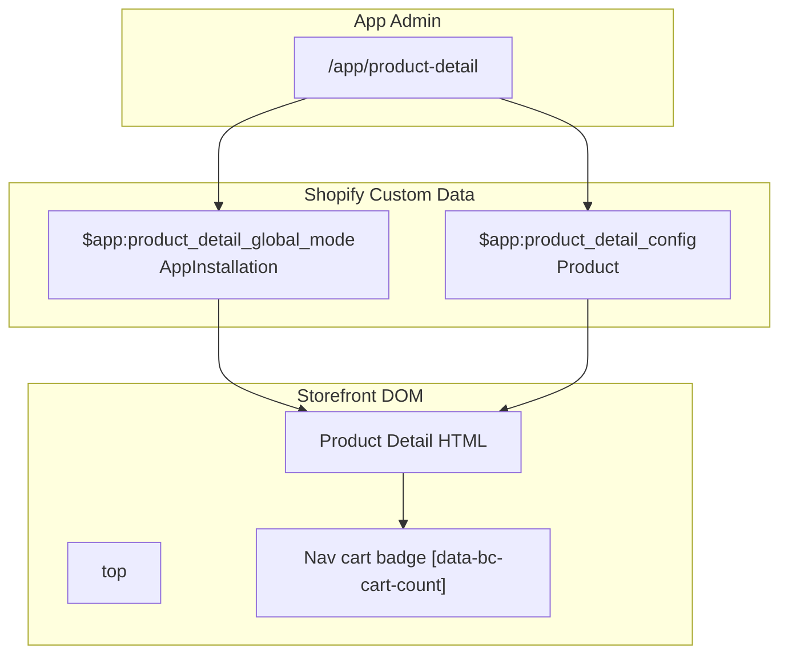

# Product Detail App Embed Design

## Context

The BC Design app currently provides two Theme App Extension embeds: **Navigation Menu** and **Banner Carousel**. Merchants configure these through the embedded app admin (`/app/navigation`, `/app/banner`), and the storefront renders them via `target: "body"` app embed blocks.

We need to add a third embed: **Product Detail** — a custom product detail page layout that replaces the theme's default product section for selected products. The design is based on the `prototype-product-detail` static prototype (Phaetus 3D printer hotend product page), adapted into a configurable Shopify App Embed with dynamic data via Product Metafields.

## Goals

- Add a new Theme App Extension block `product_detail` with `target: "body"`.
- Support per-product configuration (icons, features, subtitle, rating, option icons) stored in Product Metafields.
- Support global enablement mode (`off` / `all_on` / `per_product`) stored in AppInstallation Metafield.
- Provide an admin page (`/app/product-detail`) for merchants to search products and configure custom detail content.
- Reuse existing patterns: `MediaField`, file upload via `createShopifyFileFromUpload`, `metafieldsSet` mutation, Tailwind CSS v4 build pipeline.
- Cart AJAX API (`/cart/add.js`) for async add-to-cart with navigation cart count sync.

## Non-Goals

- 3D model / 360° viewer implementation (media icons are images only for MVP).
- Video playback beyond tab switching (Video tab is a placeholder for future expansion).
- Shopify Admin UI Extension (product page sidebar) — all configuration stays in the app admin.
- Automatic theme product section hiding — merchants handle this manually or via CSS hints.
- Tab switching interaction (3D / Parts List / Video) — tabs render as visual placeholders only; switching logic is non-goal for MVP.
- Multi-option dynamic availability: `value.available` is static based on initial selection context; disabled states for subsequent options don't refresh after switching prior options.
- High-variant products: MVP outputs all variants via Liquid `product.variants`; stores with 100+ variants per product may hit Liquid output limits or large JSON payloads.

## Decisions

| Topic | Decision |
|-------|----------|
| Storage | Product Metafield (`$app:product_detail_config`, type `json`) per product + AppInstallation Metafield (`$app:product_detail_global_mode`, type `json`) for global mode |
| Rendering | `target: "body"` app embed; `bc-design-embed-placement.js` moves block into `<main>` top |
| Theme coexistence | Fully replaces theme product section when enabled; merchant manually disables native product section |
| Cart | Shopify Cart AJAX API (`/cart/add.js`) + `/cart.js` sync for navigation badge update |
| Price formatting | Liquid pre-formatting (`v.price \| money`) into JSON `priceHtml`; JS uses `innerHTML` directly |
| Save label | Not stored in metafield; dynamically calculated in Liquid (`compare_at_price - price`) |
| File storage | GID + filename pattern (same as banner/navigation) |
| i18n | UI labels are hardcoded for MVP; locale-driven translation via Theme Extension locales or configurable labels is future work |
| Global mode `all_on` | Renders for products that have a **non-empty config**; unconfigured products fall back to theme default. Per-product `enabled` flag is **ignored** in `all_on` mode; it only applies when global mode is `per_product`. |

## Architecture



### Data Flow

1. **Merchant** searches product in app admin → fills config form → uploads icons → saves.
2. **Remix Action** calls `metafieldsSet` mutation, writing JSON to the product's `$app:product_detail_config`.
3. **Global mode** is saved to `currentAppInstallation`'s `$app:product_detail_global_mode`.
4. **Customer visits product page**; Liquid block reads `product.metafields['$app'].product_detail_config.value`.
5. **JS** handles variant selection, quantity, and async add-to-cart via `/cart/add.js`.
6. **Cart sync** fetches `/cart.js` and updates `[data-bc-cart-count]` in navigation.

## Data Model

### TypeScript Types

```typescript
// app/lib/bc-design/config-types.ts

export type ProductDetailGlobalMode = "off" | "all_on" | "per_product";

export type ProductDetailGlobalModeConfig = {
  mode: ProductDetailGlobalMode;
};

export const PRODUCT_DETAIL_GLOBAL_MODE_DEFAULTS: ProductDetailGlobalModeConfig = {
  mode: "per_product",
};

export type ProductOptionIconConfig = {
  optionName: string;
  optionValue: string;
  iconGid?: string;
  iconFilename?: string;
};

export type ProductDetailConfig = {
  enabled: boolean;

  // Media stage icons
  three60BadgeImage?: string;
  three60BadgeImageFilename?: string;
  playButtonImage?: string;
  playButtonImageFilename?: string;
  zoomButtonImage?: string;
  zoomButtonImageFilename?: string;

  // Bottom tab icons
  tab3dImage?: string;
  tab3dImageFilename?: string;
  tabPartsImage?: string;
  tabPartsImageFilename?: string;
  tabVideoImage?: string;
  tabVideoImageFilename?: string;

  // Product info
  subtitle?: string;
  rating?: number;
  ratingImage?: string;
  ratingImageFilename?: string;

  // Features
  features: string[];

  // Variant option icons
  optionIcons: ProductOptionIconConfig[];

  // Quantity stepper icons
  qtyMinusImage?: string;
  qtyMinusImageFilename?: string;
  qtyPlusImage?: string;
  qtyPlusImageFilename?: string;

  // CTA
  addToCartText?: string;
};

export const PRODUCT_DETAIL_DEFAULTS: ProductDetailConfig = {
  enabled: false,
  features: [],
  optionIcons: [],
  addToCartText: "Add to cart",
};
```

### Metafield Definitions (shopify.app.toml)

```toml
[product.metafields.app.product_detail_config]
name = "Product Detail Configuration"
type = "json"
access.admin = "merchant_read_write"
access.storefront = "public_read"

[app.metafields.app.product_detail_global_mode]
name = "Product Detail Global Mode"
type = "json"
access.admin = "merchant_read_write"
access.storefront = "public_read"
```

### Scopes Update

`write_metafields` is required for `metafieldsSet` mutations. `read_metafields` is required for Admin loader queries that read Product/AppInstallation metafields via GraphQL. Append to `scopes` in all `shopify.app.*.toml` files:

```toml
scopes = "...,write_metafields,read_metafields"
```

## Front-End Theme Extension

### `blocks/product_detail.liquid`

```liquid






  

  





<style>
  #shopify-block-{{ block.id }} {
    width: 100vw;
    max-width: 100vw;
    margin-left: calc(50% - 50vw);
    margin-right: calc(50% - 50vw);
  }
  .bc-design-embed--pending { visibility: hidden; }
</style>

<div
  data-bc-design-embed="product-detail"
  class="bc-design-embed--pending"
  {{ block.shopify_attributes }}
>
  <script type="application/json" data-bc-pd-data>
    {
      "variants": [
        
        
        
          
        
        {{ v.compare_at_price | money }}
        Save {{ v.compare_at_price | minus: v.price | money }}
        {
          "id": {{ v.id | json }},
          "options": {{ v.options | json }},
          "available": {{ v.available | json }},
          "priceHtml": {{ v.price | money | json }},
          "hasCompareAt": {{ v_has_compare | json }},
          "compareAtHtml": {{ v_compare_html | json }},
          "saveHtml": {{ v_save_html | json }}
        },
        
      ],
      "options": {{ product.options | json }}
    }
  </script>

  <section class="bc-product-detail">
    <div class="bc-product-detail__inner">
      <!-- LEFT: Media Stage -->
      <section class="bc-product-detail__media">
        <div class="bc-product-media__stage">
          
            <div class="bc-badge-360">
              
            </div>
          

          <div class="bc-product-media__hero">
            
              
            
              <div class="bc-product-media__placeholder" aria-hidden="true"></div>
            
            
              <button class="bc-play-btn" aria-label="Play 360° view">
                
              </button>
            
          </div>

          
            <button class="bc-zoom-btn" aria-label="Zoom image">
              
            </button>
          
        </div>

        <div class="bc-product-media__tabs">
          <button class="bc-tab bc-tab--active" data-tab="3d">
            
              
            
            <span>3D</span>
          </button>
          <button class="bc-tab" data-tab="parts">
            
              
            
            <span>物品清单</span>
          </button>
          <button class="bc-tab" data-tab="video">
            
              
            
            <span>Video</span>
          </button>
        </div>
      </section>

      <!-- RIGHT: Product Info -->
      <section class="bc-product-detail__info">
        <h1 class="bc-product-title">{{ product.title }}</h1>

        <div class="bc-product-subtitle-row">
          
            <span>{{ config.subtitle }}</span>
          
          
            <span class="bc-rating">{{ config.rating }}</span>
            
              
            
          
        </div>

        
          <div class="bc-features-card">
            <h2>Features</h2>
            <ul>
              
                <li>{{ feature }}</li>
              
            </ul>
          </div>
        

        <!-- Variant Options -->
        <form class="bc-product-form" data-variant-id="{{ product.selected_or_first_available_variant.id }}" data-add-to-cart-text="{{ config.addToCartText | default: 'Add to cart' | escape }}">
          
            <div class="bc-option-group" data-option-name="{{ option.name | escape }}">
              <h2>{{ option.name }}</h2>
              <div class="bc-option-pills">
                
                  
                  
                    
                      
                    
                  

                  <button
                    type="button"
                    class="bc-option-pill bc-option-pill--active"
                    data-value="{{ value.value | escape }}"
                    disabled data-disabled="true"
                  >
                    
                      
                    
                    <span>{{ value.value }}</span>
                  </button>
                
              </div>
            </div>
          

          <!-- Quantity -->
          <div class="bc-quantity-row">
            <span>Quantity</span>
            <div class="bc-qty-stepper">
              <button type="button" class="bc-qty-minus" aria-label="Decrease">
                
                  
                -
              </button>
              <span class="bc-qty-value">1</span>
              <button type="button" class="bc-qty-plus" aria-label="Increase">
                
                  
                +
              </button>
            </div>
          </div>

          <!-- Price -->
          <div class="bc-price-row">
            <span class="bc-price-current" data-current-price>
              {{ product.selected_or_first_available_variant.price | money }}
            </span>
            <span class="bc-price-save" data-save-price style="display:none;"></span>
            <span class="bc-price-compare" data-compare-price style="display:none;"></span>
          </div>

          <button
            type="button"
            class="bc-add-to-cart"
            disabled
          >
            {{ config.addToCartText | default: "Add to cart" }}
          </button>
        </form>
      </section>
    </div>
  </section>
</div>

<script>
(function () {
  var embed = document.querySelector('[data-bc-design-embed="product-detail"]');
  if (!embed) return;
  var timer = setTimeout(function () {
    embed.classList.remove('bc-design-embed--pending');
  }, 3000);
  embed.dataset.bcDesignRevealFallback = String(timer);
})();
</script>
<script src="{{ 'product-detail.js' | asset_url }}" defer></script>
<script src="{{ 'bc-design-embed-placement.js' | asset_url }}" defer></script>




{
  "name": "t:blocks.product_detail.name",
  "target": "body",
  "stylesheet": "product-detail.css",
  "settings": [
    {
      "type": "paragraph",
      "content": "Configure in Apps → BC Design → Product Detail. Renders only on product pages with enabled config."
    }
  ]
}

```

### `assets/product-detail.js`

```javascript
(function () {
  'use strict';

  var root = document.querySelector('[data-bc-design-embed="product-detail"]');
  if (!root) return;

  var dataScript = root.querySelector('script[data-bc-pd-data]');
  if (!dataScript) return;

  var pd;
  try {
    pd = JSON.parse(dataScript.textContent);
  } catch (e) {
    console.error('[BC Design] Failed to parse product detail data', e);
    return;
  }

  var form = root.querySelector('.bc-product-form');
  var addToCartBtn = root.querySelector('.bc-add-to-cart');
  var qtyValue = root.querySelector('.bc-qty-value');
  var currentPrice = root.querySelector('.bc-price-current');
  var comparePrice = root.querySelector('.bc-price-compare');
  var savePrice = root.querySelector('.bc-price-save');
  var optionGroups = root.querySelectorAll('.bc-option-group');

  var selectedOptions = {};
  pd.options.forEach(function (opt, i) {
    var selectedBtn = null;
    optionGroups.forEach(function (group) {
      if (group.dataset.optionName === opt) {
        selectedBtn = group.querySelector('.bc-option-pill--active');
      }
    });
    selectedOptions[opt] = selectedBtn ? selectedBtn.dataset.value : (pd.variants[0] ? pd.variants[0].options[i] : '');
  });

  // Initial state sync
  updateVariant(findVariantByOptions());

  function findVariantByOptions() {
    return pd.variants.find(function (v) {
      return v.options.every(function (val, i) {
        return val === selectedOptions[pd.options[i]];
      });
    });
  }

  function updateVariant(variant) {
    if (!variant) {
      if (addToCartBtn) {
        addToCartBtn.disabled = true;
        addToCartBtn.textContent = 'Unavailable';
      }
      form.removeAttribute('data-variant-id');
      if (currentPrice) currentPrice.textContent = 'Unavailable';
      if (comparePrice) { comparePrice.style.display = 'none'; comparePrice.innerHTML = ''; }
      if (savePrice) { savePrice.style.display = 'none'; savePrice.innerHTML = ''; }
      return;
    }
    form.dataset.variantId = String(variant.id);
    if (currentPrice) currentPrice.innerHTML = variant.priceHtml;
    if (comparePrice) {
      comparePrice.style.display = variant.hasCompareAt ? '' : 'none';
      comparePrice.innerHTML = variant.compareAtHtml;
    }
    if (savePrice) {
      savePrice.style.display = variant.hasCompareAt ? '' : 'none';
      savePrice.innerHTML = variant.saveHtml;
    }
    if (addToCartBtn) {
      addToCartBtn.disabled = !variant.available;
      if (addToCartBtn.textContent === 'Unavailable') {
        addToCartBtn.textContent = form.dataset.addToCartText || 'Add to cart';
      }
    }
  }

  optionGroups.forEach(function (group) {
    group.querySelectorAll('.bc-option-pill').forEach(function (btn) {
      btn.addEventListener('click', function () {
        if (btn.disabled) return;
        var optionName = group.dataset.optionName;
        var value = btn.dataset.value;
        selectedOptions[optionName] = value;

        group.querySelectorAll('.bc-option-pill').forEach(function (p) {
          p.classList.toggle('bc-option-pill--active', p.dataset.value === value);
        });

        var matched = findVariantByOptions();
        updateVariant(matched);
      });
    });
  });

  root.querySelector('.bc-qty-minus')?.addEventListener('click', function () {
    var val = parseInt(qtyValue.textContent, 10) || 1;
    qtyValue.textContent = String(Math.max(1, val - 1));
  });
  root.querySelector('.bc-qty-plus')?.addEventListener('click', function () {
    var val = parseInt(qtyValue.textContent, 10) || 1;
    qtyValue.textContent = String(val + 1);
  });

  if (addToCartBtn) {
    addToCartBtn.addEventListener('click', function () {
      var variantId = form.dataset.variantId;
      var qty = parseInt(qtyValue.textContent, 10) || 1;
      if (!variantId) return;
      addToCartBtn.disabled = true;

      var originalText = addToCartBtn.textContent;
      var didAddToCartSucceed = false;
      fetch('/cart/add.js', {
        method: 'POST',
        headers: { 'Content-Type': 'application/json' },
        body: JSON.stringify({ items: [{ id: variantId, quantity: qty }] })
      })
      .then(function (res) {
        return res.json().catch(function () {
          throw new Error('Unable to add');
        }).then(function (data) {
          if (!res.ok) throw new Error(data.description || data.message || 'Unable to add');
          return data;
        });
      })
      .then(function () {
        didAddToCartSucceed = true;
        addToCartBtn.textContent = 'Added ✓';
        addToCartBtn.style.backgroundColor = 'var(--color-bc-pd-primary-500)';
        setTimeout(function () {
          addToCartBtn.textContent = originalText;
          addToCartBtn.style.backgroundColor = '';
          var matched = findVariantByOptions();
          addToCartBtn.disabled = matched ? !matched.available : true;
        }, 1200);
        // Cart sync is independent — failure only warns, doesn't break success feedback
        fetch('/cart.js')
          .then(function (r) { return r.json(); })
          .then(function (cart) {
            document.querySelectorAll('[data-bc-cart-count]').forEach(function (el) {
              el.textContent = String(cart.item_count);
              el.dataset.count = String(cart.item_count);
              if (el.hidden !== undefined) el.hidden = cart.item_count === 0;
            });
          })
          .catch(function (syncErr) {
            console.warn('[BC Design] Cart count sync failed:', syncErr);
          });
      })
      .catch(function (err) {
        console.error('[BC Design] Add to cart failed:', err);
        addToCartBtn.textContent = err.message || 'Failed';
        setTimeout(function () {
          addToCartBtn.textContent = originalText;
        }, 1200);
      })
      .finally(function () {
        if (!didAddToCartSucceed) {
          var matched = findVariantByOptions();
          addToCartBtn.disabled = matched ? !matched.available : true;
        }
        // Success path re-enables inside its setTimeout to prevent double-add
      });
    });
  }
})();
```

### `assets/bc-design-embed-placement.js` — Product Detail Branch

Add to existing `runPlacement()`:

```javascript
const PRODUCT_DETAIL_SELECTOR = '[data-bc-design-embed="product-detail"]';

// In runPlacement():
const pdEmbed = document.querySelector(PRODUCT_DETAIL_SELECTOR);
const pdBlock = getBlockWrapper(pdEmbed);

if (pdBlock) {
  // Prefer page-level containers; avoid nesting inside native product section
  const pageTarget = document.querySelector('main, #MainContent, [role="main"]');
  if (pageTarget) {
    if (pageTarget.firstElementChild !== pdBlock) {
      pageTarget.insertBefore(pdBlock, pageTarget.firstElementChild);
    }
  } else {
    const sectionTarget = document.querySelector('.shopify-section-main-product, #shopify-section-main-product');
    if (sectionTarget?.parentNode) {
      sectionTarget.parentNode.insertBefore(pdBlock, sectionTarget);
    } else {
      document.body.insertBefore(pdBlock, document.body.firstElementChild);
    }
  }
}
```

### Tailwind CSS Build

**Source:** `tailwind/bc-design-theme/product-detail.tailwind.css`

Follows the same Tailwind CSS v4 pattern as banner and navigation:

```css
@layer theme, components, utilities;

@import "tailwindcss/theme.css" layer(theme);
@reference "tailwindcss";

@theme {
  --color-bc-pd-ink: oklch(21.08% 0.018 285.94);
  --color-bc-pd-ink-secondary: oklch(46.4% 0.026 285.94);
  --color-bc-pd-primary-500: oklch(58.83% 0.194 146.08);
  --color-bc-pd-accent-500: oklch(53.18% 0.241 21.53);
  --color-bc-pd-surface: oklch(97.88% 0.005 286.28);
  --color-bc-pd-border: oklch(88.39% 0.015 285.94);
}

@layer components {
  .bc-product-detail { /* layout wrapper */ }
  .bc-product-detail__inner { /* two-column grid */ }
  .bc-option-pill { /* option button base */ }
  .bc-option-pill--active { /* selected state */ }
  .bc-option-pill[data-disabled="true"] { /* unavailable state */ }
}
```

**Build output:** `extensions/bc-design-theme/assets/product-detail.css`

**Package script:** replace `dev:web` in `package.json` with all three Tailwind watchers running in background before the dev server:
```json
"dev:web": "npx tailwindcss -i ./tailwind/bc-design-theme/banner-carousel.tailwind.css -o ./extensions/bc-design-theme/assets/banner-carousel.css --watch --minify & npx tailwindcss -i ./tailwind/bc-design-theme/navigation-menu.tailwind.css -o ./extensions/bc-design-theme/assets/navigation-menu.css --watch --minify & npx tailwindcss -i ./tailwind/bc-design-theme/product-detail.tailwind.css -o ./extensions/bc-design-theme/assets/product-detail.css --watch --minify & npx prisma migrate deploy && npm exec react-router dev"
```

### Navigation Cart Badge

In `snippets/nav_header_icons.liquid`, add count badge:

```liquid
<a href="{{ routes.cart_url }}" class="icon-btn cart-icon" aria-label="Cart">
  <svg>...</svg>
  <span data-bc-cart-count data-count="{{ cart.item_count }}" class="cart-count-badge">{{ cart.item_count }}</span>
</a>
```

## Admin Back-End

### `app/routes/app.product-detail.tsx`

**Loader:**

```typescript
export const loader = async ({ request }: LoaderFunctionArgs) => {
  const { admin } = await authenticate.admin(request);
  const url = new URL(request.url);
  const searchQuery = url.searchParams.get("q") || "";
  const selectedProductId = url.searchParams.get("product") || "";

  const globalConfig = await loadProductDetailGlobalModeConfig(admin);

  let products = [];
  if (searchQuery) {
    const data = await adminGraphql<any>(admin, SEARCH_PRODUCTS_QUERY, { query: searchQuery });
    products = data.products?.edges?.map((e: any) => e.node) ?? [];
  }

  let productConfig = null;
  let productOptions = [];
  let filePreviewUrls = {};
  let selectedProduct = null;

  if (selectedProductId) {
    const data = await adminGraphql<any>(admin, GET_PRODUCT_CONFIG_QUERY, { id: selectedProductId });
    const product = data.product;
    selectedProduct = product ? { id: product.id, title: product.title, handle: product.handle } : null;
    productOptions = product?.options ?? [];
    const rawConfig = product?.metafield?.jsonValue;
    productConfig = rawConfig ? sanitizeProductDetailConfig(rawConfig) : { ...PRODUCT_DETAIL_DEFAULTS, features: [], optionIcons: [] };
    const gids = collectFileGids(productConfig);
    filePreviewUrls = await resolveFilePreviewUrls(admin, gids);
  }

  return { globalConfig, products, searchQuery, selectedProductId, selectedProduct, productConfig, productOptions, filePreviewUrls };
};
```

**Action:**

```typescript
export const action = async ({ request }: ActionFunctionArgs) => {
  const { admin } = await authenticate.admin(request);
  const formData = await request.formData();
  const intent = String(formData.get("intent") ?? "");

  if (intent === "saveGlobalMode") {
    const mode = String(formData.get("mode") ?? "per_product");
    const validModes: ProductDetailGlobalMode[] = ["off", "all_on", "per_product"];
    if (!validModes.includes(mode as ProductDetailGlobalMode)) {
      return { intent, ok: false, message: "Invalid mode." };
    }
    await saveProductDetailGlobalModeConfig(admin, { mode: mode as ProductDetailGlobalMode });
    return { intent, ok: true, message: "Global mode saved." };
  }

  if (intent === "saveProductConfig") {
    const productId = String(formData.get("productId") ?? "");
    const configRaw = formData.get("config");
    if (!productId || typeof configRaw !== "string") {
      return { intent, ok: false, message: "Missing product or config." };
    }
    if (!productId.startsWith("gid://shopify/Product/")) {
      return { intent, ok: false, message: "Select a valid product." };
    }
    const previous = await loadProductDetailConfig(admin, productId);
    const config = parseProductDetailConfigPayload(configRaw);
    await mergeUploadedProductFiles(admin, formData, config, previous, productId);
    await saveProductDetailConfig(admin, productId, config);
    const saved = await loadProductDetailConfig(admin, productId);
    const filePreviewUrls = await resolveFilePreviewUrls(admin, collectFileGids(saved));
    return { intent, ok: true, message: "Product config saved.", config: saved, filePreviewUrls };
  }

  return { intent, ok: false, message: "Unknown action." };
};
```

### GraphQL Queries

**`SEARCH_PRODUCTS_QUERY`** (Loader, when `q` present):

```graphql
query SearchProducts($query: String!) {
  products(first: 20, query: $query) {
    edges {
      node {
        id
        title
        handle
        featuredImage { url }
      }
    }
  }
}
```

**`GET_PRODUCT_CONFIG_QUERY`** (Loader, when `product` selected):

```graphql
query GetProductConfig($id: ID!) {
  product(id: $id) {
    id
    title
    handle
    options {
      name
      values
    }
    metafield(namespace: "$app", key: "product_detail_config") {
      jsonValue
    }
  }
}
```

### Helper Functions (local to `app.product-detail.tsx`)

These helpers are defined within the route file, following the banner/navigation page pattern:

| Function | Purpose |
|----------|---------|
| `collectFileGids(config: ProductDetailConfig): string[]` | Extracts all GID-bearing fields (`*Image`, `iconGid`) from a config object for batch URL resolution |
| `resolveFilePreviewUrls(admin, gids: string[]): Promise<Record<string, string>>` | Batch-resolves Shopify file GIDs to CDN preview URLs via GraphQL `nodes` query |
| `sanitizeProductDetailConfig(raw: unknown): ProductDetailConfig` | Validates and normalizes raw metafield JSON into a typed config with safe defaults |
| `parseProductDetailConfigPayload(raw: string): ProductDetailConfig` | Parses the JSON string submitted from the admin form |
| `mergeUploadedProductFiles(admin, formData, config, previous, productId)` | Handles file uploads from form data, updates config GID/filename fields when replacement is uploaded; preserves previous references otherwise |

### Page Structure

```tsx
<s-page heading="Product Detail">
  <s-button slot="primary-action" onClick={handleSave} loading={isSubmitting}>Save</s-button>

  <s-section heading="Global mode">
    <s-select value={globalMode} onChange={...}>
      <s-option value="off">Off</s-option>
      <s-option value="all_on">All products</s-option>
      <s-option value="per_product">Per product</s-option>
    </s-select>
    <s-button onClick={saveGlobalMode}>Save global mode</s-button>
  </s-section>

  <s-section heading="Select product">
    <form method="get">
      <s-text-field value={searchInput} onChange={...} />
      <s-button type="submit">Search</s-button>
    </form>
    {selectedProduct && (
      <div className="bc-selected-product-summary">
        <strong>{selectedProduct.title}</strong>
        <span>/{selectedProduct.handle}</span>
      </div>
    )}
    {products.length > 0 && (
      <s-select value={selectedProductId} onChange={...}>
        {products.map(p => <s-option value={p.id}>{p.title}</s-option>)}
      </s-select>
    )}
  </s-section>

  {selectedProductId && productConfig && (
    <s-section heading="Product configuration">
      <s-switch label="Enable custom product detail" checked={formState.enabled} ... />

      <MediaField label="360° Badge" ... />
      <MediaField label="Play Button" ... />
      <MediaField label="Zoom Button" ... />
      <MediaField label="Tab 3D" ... />
      <MediaField label="Tab Parts" ... />
      <MediaField label="Tab Video" ... />

      <s-text-field label="Subtitle" value={formState.subtitle} ... />
      <s-number-field label="Rating" value={formState.rating} ... />
      <MediaField label="Rating stars icon" ... />

      <s-section heading="Features">
        {formState.features.map((f, i) => (
          <s-stack direction="inline">
            <s-text-field value={f} onChange={...} />
            <s-button onClick={() => removeFeature(i)}>Remove</s-button>
          </s-stack>
        ))}
        <s-button onClick={addFeature}>Add feature</s-button>
      </s-section>

      {productOptions.map(option => (
        <s-section heading={`Option icons: ${option.name}`}>
          {option.values.map(value => (
            <MediaField
              label={value}
              value={getOptionIconGid(option.name, value)}
              onChange={...}
            />
          ))}
        </s-section>
      ))}

      <MediaField label="Qty minus icon" ... />
      <MediaField label="Qty plus icon" ... />

      <s-text-field label="Add to cart text" value={formState.addToCartText} ... />
    </s-section>
  )}
</s-page>
```

## File Inventory

### New Files

| Path | Description |
|------|-------------|
| `app/lib/bc-design/config-types.ts` additions | `ProductDetailConfig`, `ProductOptionIconConfig`, `ProductDetailGlobalModeConfig`, defaults |
| `app/lib/bc-design/config.server.ts` additions | `loadProductDetailConfig`, `saveProductDetailConfig`, `loadProductDetailGlobalModeConfig`, `saveProductDetailGlobalModeConfig` |
| `app/routes/app.product-detail.tsx` | Admin configuration page |
| `extensions/bc-design-theme/blocks/product_detail.liquid` | App Embed block |
| `extensions/bc-design-theme/assets/product-detail.js` | Client-side interaction |
| `tailwind/bc-design-theme/product-detail.tailwind.css` | Tailwind v4 source |

### Modified Files

| Path | Change |
|------|--------|
| `app/routes/app.tsx` | Add `<s-link href="/app/product-detail">` to `<s-app-nav>` |
| `extensions/bc-design-theme/assets/bc-design-embed-placement.js` | Add `PRODUCT_DETAIL_SELECTOR` branch in `runPlacement()` |
| `extensions/bc-design-theme/snippets/nav_header_icons.liquid` | Add `<span data-bc-cart-count>` badge |
| `extensions/bc-design-theme/locales/en.default.schema.json` | Add `product_detail` block schema name (see Locale Translations below) |
| `shopify.app.toml` / `.localhost.toml` / `.render.toml` | Append `write_metafields,read_metafields` to scopes; add metafield definitions |
| `package.json` | Add `product-detail.tailwind.css` to `dev:web` script |

### Deleted Files

None.

### Locale Translations

**`extensions/bc-design-theme/locales/en.default.schema.json`** — append to existing `blocks` object:

```json
{
  "blocks": {
    "navigation_menu": {
      "name": "BC Design Navigation"
    },
    "banner_carousel": {
      "name": "BC Design Banner"
    },
    "product_detail": {
      "name": "Product detail"
    }
  }
}
```

## Verification

### Theme Editor

- `product_detail` block appears under **App embeds**.
- Toggle enable/disable without errors.
- Paragraph instructions display correctly.

### Storefront

- **Product page with config enabled:** custom detail renders with correct data, icons, features, option pills.
- **Product page with config disabled (per_product mode):** no custom detail markup.
- **All products mode:** product pages with non-empty config render custom detail.
- **Off mode:** no custom detail markup on any product page.
- **Variant selection:** price updates correctly via `priceHtml` innerHTML; disabled pills are unclickable.
- **Add to cart:** async add-to-cart with "Added ✓" feedback; navigation cart count updates.
- **Out of stock:** add-to-cart button disabled on initial render and after variant switch.
- **Placement:** product detail block sits before native product section or at top of main/page container, not at original app-embed bottom.
- **CLS:** no visible jump on slow network; `bc-design-embed--pending` fail-open.

### Admin

- Global mode save persists and reflects on storefront.
- Product search returns results.
- Product config save persists; uploaded icons show preview immediately after save.
- Features list add/remove works.
- Option icons upload per option value.

### Automated

- `npm test`, `npm run typecheck`, `npm run lint` pass.
- `shopify app config validate` passes.
- `product-detail.js` tests: variant switch, unmatched combo, compare/save toggle, add-to-cart non-2xx response, cart sync failure.
- `bc-design-embed-placement.test.js` covers: product detail inserted at top of `main`, inserted before native product section, `document.body` fallback, coexistence with nav/banner.
- After adding `write_metafields,read_metafields` to scopes, run `shopify app dev` to trigger scope update flow for the dev store, or reinstall the app if scopes are rejected. Production deployments require `shopify app deploy` followed by merchant re-authorization if new scopes are requested.
